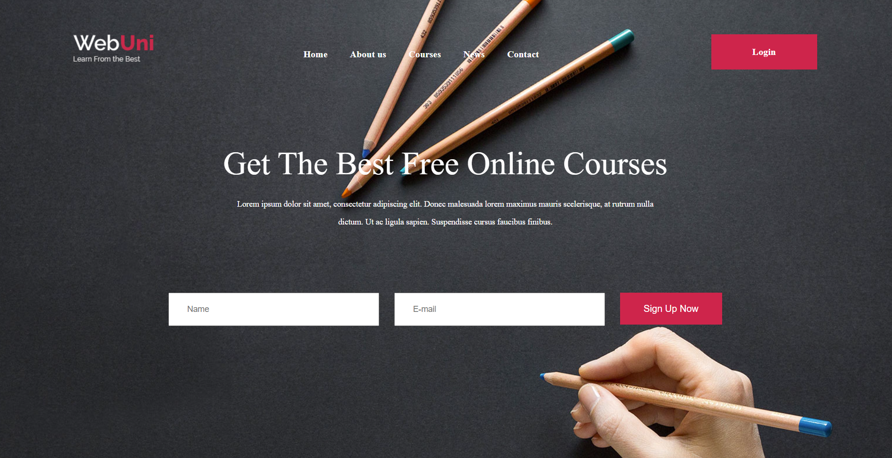

# Online Learning Landing Page 🎓  

A modern and responsive landing page for an online learning platform. Built using **HTML & CSS** as part of my learning journey at ITI.  

## 🚀 Features  
✅ Responsive design  
✅ Structured navigation bar  
✅ Hero section with a signup form  
✅ Course categories & featured courses  
✅ Clean and modern UI  

## 🛠 Technologies Used  
- **HTML5**  
- **CSS3** (Flexbox & Grid)  

## 📸 Screenshot  
  

## 🔗 Live Demo  
[View Project](https://ahmoooos.github.io/Online-Learning-Landing-Page/)  

## 📂 How to Run Locally  
1. Clone this repository:  
   ```sh
   git clone https://github.com/yourusername/Online-Learning-Landing-Page.git
2- Open template.html in your browser.

📌 What I Learned
Structuring HTML for better readability
Styling with CSS for an engaging UI
Making the design responsive

💬 Feedback is welcome! Feel free to contribute or suggest improvements. 🚀
